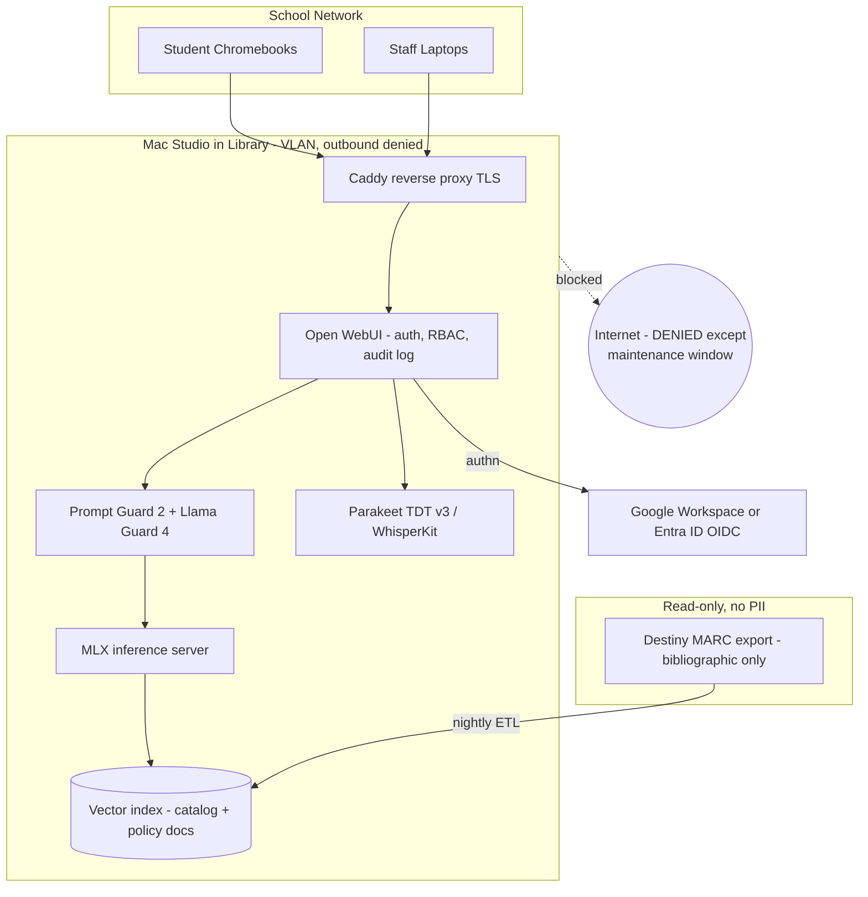

# On-Premises AI Assistant for a Wisconsin Middle School Library

## The core idea

Buy one Mac Studio, put it physically in the library, block its outbound internet access at the firewall, and run everything on it. This turns the hardest compliance question ("what happens to our students' data?") into a trivially demonstrable one: nothing leaves the building, and you can prove it with a firewall rule.

This also solves the funding problem. Wis. Stat. 43.70(3) permits Common School Fund (Library Aid) dollars for "school library computers and related software" under three conditions, all of which this design meets:
- The school board consults the district's licensed library media specialist (PI 8.01(2)(h))
- The computers are **housed in the school library** — the Mac Studio's form factor makes this literal
- Purchases align with the district's written long-range library plan

Coded to WUFAR Function 222000, Project Code 031. Talk to Monica Treptow (monica.treptow@dpi.wi.gov), DPI's School Library Education Consultant, before you order.

## Hardware and budget

### Recommended build

- Mac Studio, M5 Max, 18-core CPU / **40-core GPU** (the 40-core tier is required to access 64GB+ and gets you 614GB/s vs 460GB/s of memory bandwidth): $3,100
- **128GB unified memory**: +$2,000
- 1TB internal SSD: +$300
- Subtotal: **$5,400** (roughly $5,000-5,200 at Apple education institutional pricing; base M5 Max education price is $2,299 vs $2,499 retail)

Skip the 8TB internal SSD. It costs $3,800 and buys nothing a $350 external Thunderbolt 5 NVMe enclosure won't.

### Why 128GB and not 64GB

$1,600 is a real difference, so here is the honest tradeoff. At 64GB you can comfortably run Qwen3.6-35B-A3B (about 23GB at Q4, ~59 tok/s) alongside embeddings, a guard model, and speech-to-text. That is genuinely enough for readers' advisory and staff work.

128GB buys three things: the ability to run gpt-oss-120b (66GB, Apache 2.0, strong tool calling) or Qwen3.5-122B-A10B (70GB) for research-help quality; enough headroom to keep the big model, the fast model, the guard model, and the speech model all resident simultaneously so nothing swaps when a class of 25 hits it at once; and KV cache room for concurrent long-context sessions, which is the real memory sink in a multi-user deployment.

Memory is soldered and cannot be upgraded later. On a 5-7 year school asset, buy the memory.

### Full year-one budget

- Mac Studio as specced: $5,400
- AppleCare+ for Mac, 3 years: ~$380
- External TB5 NVMe 4TB (model weights, indexes): ~$400
- Second external drive for Time Machine: ~$300
- UPS, 1500VA: ~$200
- Physical security (locking enclosure, Kensington cable): ~$150
- Software: **$0** — every component below is open source
- Summer/after-hours setup stipend for the librarian and a district IT partner: $1,500-3,000
- Staff PD (two half-day sessions): ~$1,000

**Year one: roughly $9,300-11,000.** Ongoing after that is about $60/year in electricity plus staff time (budget 2-4 hours/week of librarian attention).

If the board balks, a 64GB build with no stipend lands near **$6,500** and is a legitimate pilot.

### Why a Mac and not a Linux box with NVIDIA GPUs

An RTX-based server wins on raw prompt-processing throughput and concurrency. It loses on everything else that matters here: noise, heat, power, physical footprint, needing a rack, needing a Linux admin, and — decisively — the Common School Fund requirement that the machine be housed in the library. A quiet 6-pound box on a shelf satisfies the statute. A rack-mount server in the district datacenter does not.

## Expected performance

### The two numbers that matter

LLM inference has two phases with completely different bottlenecks, and conflating them is why most capacity estimates are wrong.

**Prefill** (reading your prompt, determines time-to-first-token) is compute-bound. This is exactly what the M5's Neural Accelerators — new dedicated matrix hardware in each of the 40 GPU cores, roughly 70 TFLOPS FP16 aggregate — were built for. Measured on M5 Max at int4 with 4,096-token prompts by the `mlx_transformers_benchmark` project:

- Qwen 3.5 35B-A3B (MoE): **2,725 tok/s** (3.5x the M4 Pro)
- Qwen 3.5 9B: 1,740 tok/s
- Qwen 3.5 27B (dense): 476 tok/s

**Decode** (generating the answer) is memory-bandwidth-bound and improves only with bandwidth — about 1.2-1.25x from M4 Max to M5 Max (546 to 614 GB/s). Expect roughly **60-90 tok/s** for a 35B-A3B and **30-50 tok/s** for gpt-oss-120b. Verify these on the actual box; they are extrapolations, not measurements.

Note the enormous gap between the MoE and dense numbers: 2,725 vs 476 tok/s prefill. **Use mixture-of-experts models with small active-parameter counts.** This single choice matters more for perceived speed than anything else in the plan.

### What one user experiences

A realistic RAG query is about 6,000 prompt tokens (system prompt, eight retrieved catalog chunks, conversation history) producing a 400-token answer:

- Qwen3.6-35B-A3B: about **2.2 seconds** to first token, then roughly 5 seconds of streaming. ~7s total.
- gpt-oss-120b: about **4 seconds** to first token, then roughly 10 seconds streaming. ~14s total.

For comparison, a frontier API typically delivers first token in 0.5-1.5s and streams at 40-100 tok/s. So the local 35B model is within about 2x on time-to-first-token and **comparable or faster on streaming speed**. For a single user, this does not feel like a downgrade.

### What a class experiences

Here is the constraint that actually determines capacity: **prefill is serialized on the GPU and shared across everyone.** Total prefill budget is ~2,725 tok/s no matter how many people are asking. Decode batches efficiently; prefill does not.

Worst-case time-to-first-token for the last person in a simultaneous burst, at 6,000 tokens per query:

- 5 concurrent: ~11 seconds
- 10 concurrent: ~22 seconds
- 25 concurrent: ~55 seconds

That 25-user number is unacceptable, and it is also the wrong number to plan around. Two things fix it:

1. **Prefix caching plus tight retrieval.** The system prompt and persona (~1,500 tokens) are identical for every request and should be cached, not re-processed. Cutting retrieval from eight chunks to four drops the unique portion to ~2,500 tokens. Combined, the per-query prefill cost falls roughly 60%: 10 concurrent users now see ~9 seconds worst case.
2. **Duty cycle.** A class of 25 doing an activity does not submit simultaneously. Students spend most of their time reading and typing, so realistic in-flight concurrency is 4-6 requests, not 25.

### The verdict

- **Phase 1, staff only (1-5 users):** Indistinguishable from a frontier model in responsiveness. No concerns at all.
- **Phase 2, one supervised class (~25 students, 4-6 concurrent):** Genuinely usable. Typical time-to-first-token of 2-4 seconds, with occasional 10-15 second waits during bursts. Requires prefix caching, top-4 retrieval, streaming responses, and a visible queue position. Plan the lesson so a few seconds of thinking time is fine rather than dead air.
- **Phase 3, whole-school self-serve (500 students, 30-60 concurrent at peak):** **Not viable on one machine.** This is a hard finding, not a tuning problem. Serving the whole school means a second Mac Studio behind a load balancer, or restricting self-serve to a smaller cohort. Budget for this decision rather than discovering it in April.

### Quality versus a frontier model, honestly

The speed gap is small. The quality gap varies enormously by task:

- **Readers' advisory and catalog search:** No meaningful gap. These are retrieval-grounded tasks where the quality ceiling is set by how well you chunk MARC records, not by model size. Your ingest pipeline is the bottleneck, not the model.
- **Staff writing** (booktalks, newsletters, weeding reports, grant drafts): No meaningful gap.
- **Transcription:** Local **wins outright**. Parakeet TDT v3 beats cloud Whisper on English word error rate (6.32% vs 7.83%) and runs about 10x faster.
- **Research help and source evaluation:** A real but modest gap. gpt-oss-120b closes most of it. A seventh grader asking why the Civil War started is not stressing the limits of a 120B model.
- **Multi-step math:** A real gap. Do not market this as a math tutor.

### What this does to the 128GB decision

Keeping everything resident avoids model-swap stalls, since loading 66GB of weights from SSD takes tens of seconds and would be the worst latency in the system. Full residency costs roughly: 35B-A3B (23GB) + gpt-oss-120b (66GB) + Llama Guard 4 (8GB) + embeddings (2GB) + Parakeet (2GB) = **~101GB**, leaving ~27GB for KV cache and macOS.

**That does not fit in 64GB.** A 64GB box can hold the 35B model and the guard model and nothing else, which means either giving up gpt-oss-120b entirely or eating a swap stall every time someone switches. This is a sharper argument for 128GB than the general "future-proofing" one.

One required tuning step: macOS caps GPU-wired memory well below the physical total by default. Raise it with `iogpu.wired_limit_mb` (around 118000 on a 128GB machine), declared in the nix-darwin config rather than typed by hand.

## Prototyping on an M5 Pro (24GB) before buying

We have an M5 Pro / 24GB laptop available now. This should absolutely be Phase 0 work, because the M5 Pro is the **same microarchitecture** as the M5 Max — same Neural Accelerators, same `mlx_metal_v4` MLX path on macOS 26, same arm64 Nix story. Extrapolating between them is a scaling calculation, not a generational guess.

### The scaling factors

- **Memory bandwidth: 307 GB/s → 614 GB/s = exactly 2.0x.** Decode throughput scales with this almost linearly, so any tok/s you measure roughly doubles.
- **GPU cores: 16 or 20 → 40 = 2.0-2.5x.** Prefill is compute-bound and also benefits from the bandwidth increase, so expect **2.0-2.5x** on time-to-first-token. Confirm which GPU tier the laptop has; 24GB is the base config, which suggests the 16-core variant and therefore the more favorable 2.5x ratio.

**Rule of thumb: measure on the Pro, double it, and that is the Max.** Conservative on prefill, accurate on decode.

One methodological warning: only compare against published M5 Max numbers produced by the *same* harness and model. Public benchmarks disagree wildly across tools — oMLX reports an M5 Pro (20c) doing 466 tok/s prefill on Qwen3.8-27B while `mlx_transformers_benchmark` reports an M5 Max doing 476 tok/s on Qwen3.5-27B, which would imply zero speedup and is obviously a harness artifact. Standardize on `mlx_transformers_benchmark`, since that is where the published M5 Max figures in this plan come from, and calibrate with a model both machines can run.

### What actually fits in 24GB

macOS leaves roughly 16-18GB usable for models. Real measured data point: a 27B dense model at Q4 peaks at 18.9GB, which confirms it fits and leaves room for nothing else.

- Fits comfortably: Gemma 4 12B dense (7-8GB), Qwen3.5-4B, Prompt Guard 2 (22M), an embedding model (~1GB), Parakeet TDT v3 (~2GB)
- Fits alone: gpt-oss-20b MoE (14GB), Gemma 4 26B-A4B (16-18GB), a 27B dense (~19GB)
- **Does not fit:** Qwen3.6-35B-A3B (19-23GB) with anything else resident, and obviously not gpt-oss-120b

So run two separate prototype profiles rather than one:

- **`dev-pipeline`:** Gemma 4 12B + Prompt Guard 2 + embeddings + Parakeet, roughly 12GB, everything resident. This is the profile for building and testing the actual system end to end.
- **`dev-perf`:** gpt-oss-20b alone. A small-active MoE is the right architectural proxy for the models the Max will run, so this is the profile for the scaling measurements.

### What transfers, and what does not

Transfers essentially 1:1 — this is most of the work:

- The entire nix-darwin flake and every flox environment. Same OS, same architecture.
- **The Ollama/MLX packaging bake-off.** This is the big win. The `mlx_metal_v4` dylib question, the nixpkgs-versus-official-app decision, whether `services.ollama` works — all of it is architecture-dependent, not memory-dependent, and the M5 Pro is an M5. **The sharpest edge in the plan can be fully resolved before the Mac Studio ships.**
- The MARC ingest pipeline, chunking strategy, and retrieval quality. Retrieval quality is model-independent and is where most of the actual value lives. You can perfect it on the laptop.
- Caddy, Open WebUI, OIDC, RBAC, the retention purge, audit logging, the safety pipeline's control flow, and the escalation routing.
- The shape of the concurrency curve, and therefore whether prefix caching and top-4 retrieval deliver the predicted ~60% reduction.

Does not transfer:

- Absolute throughput (apply the 2x).
- Model residency behavior, which is the entire 128GB argument and cannot be observed on 24GB.
- **Answer quality.** See the warning below.

### The one thing that could sink the project

**Do not let the librarian judge answer quality on the M5 Pro.** A 12B model will underwhelm on readers' advisory, someone will conclude "local AI isn't good enough," and a false negative kills the purchase.

There is a clean way around this. gpt-oss-120b is open-weight and available on hosted APIs, so you can evaluate its quality through an API using the librarian's golden question set — which contains no student PII, just questions about books — and then run **the identical weights** locally in production. Quality is settled before you spend a dollar on hardware, without ever sending student data anywhere.

### Laptop-specific practicalities

- **Two `darwinConfigurations` in one flake:** `dev` for the laptop (toolchain and flox only) and `library` for the Mac Studio (the full locked-down configuration), sharing common modules. Do not apply the library's egress-deny firewall to a daily driver.
- **flox `[services]` is the right lifecycle on the laptop** — services start on `flox activate` and stop on exit — while the same manifests run under `launchd` on the Studio. One definition, two lifecycles.
- **Expect thermal throttling.** Sustained load tests on a laptop will be noisy and pessimistic. Run plugged in, and treat the numbers as a lower bound before applying the 2x.
- **Leave `iogpu.wired_limit_mb` mostly alone here.** On 24GB the default ceiling of ~18GB is close to the safe maximum; pushing past ~19000 risks system instability for little gain.

## Wiring the prototype into the existing workstation repo

[imkarrer/workstation](https://github.com/imkarrer/workstation) is already nix-darwin + nix-homebrew + flox with an in-repo trusted cask tap. That is exactly the shape this needs, so the additions are small and follow the repo's own placement rules.

### Yes, nix-darwin can still install Ollama

This is the direct answer to the packaging worry: `nix-homebrew` is already enabled in `flake.nix`, so a cask entry **is** a nix-darwin-managed install. It is declarative, it is in git, and `darwin-switch` applies it. You are not stepping outside the system to get the real MLX backend.

The repo's own rule already decides the placement — "Chrome belongs in `darwin/homebrew.nix` (`homebrew.casks`), not flox. Flox can install Chrome from the catalog, but it will not show up properly in Launchpad/Spotlight." Ollama.app is a menubar `.app` bundle, so it follows Chrome:

```nix
# darwin/homebrew.nix
casks = [
  "claude"
  "claude-code"
  "google-chrome"
  "ollama-app"        # NOT the `ollama` formula — see the trap above
  # …
];
```

### Ollama environment variables need launchd, not zsh

A documented footgun that bites nearly everyone: the cask runs Ollama as a macOS **app**, which never reads `.zshrc`, so exported variables are silently ignored. The usual advice is to run `launchctl setenv` by hand — which is exactly the kind of undeclared state this repo exists to eliminate. nix-darwin has a declarative equivalent:

```nix
# darwin/ai.nix
launchd.user.envVariables = {
  OLLAMA_KEEP_ALIVE     = "-1";      # pin models in memory
  OLLAMA_CONTEXT_LENGTH = "16384";   # default is 2048 and will ruin RAG
  OLLAMA_FLASH_ATTENTION = "1";
  OLLAMA_NUM_PARALLEL   = "4";       # tune from load-test results
};
```

### Pinning the version for reproducible benchmarks

Casks track latest, which is wrong for a benchmark baseline and actively dangerous given Ollama's track record: 0.12.9 shipped a regression that silently fell back from GPU to CPU (users reported dropping from 53 tok/s to 7), and 0.20.4 shipped x86_64-only MLX dylibs that failed to load on arm64 at all.

The repo already solves this — `Casks/` is a trusted in-repo tap with `clone_target` pointing at the local checkout, and `dr-sprinto` is already installed that way. Adding `Casks/ollama-pinned.rb` with a fixed version and sha256 makes the runtime reproducible across the laptop, a rented machine, and eventually the Mac Studio. Start with upstream `ollama-app` to get moving, then pin once a baseline exists. Remember the repo's noted quirk: after bumping an in-repo cask, `brew untap imkarrer/casks` before `darwin-switch`.

### Where the rest goes

Following the repo's placement table:

- **`darwin/homebrew.nix`** — the `ollama-app` cask.
- **`darwin/ai.nix`** (new, imported from `flake.nix`) — the `launchd.user.envVariables` block. Keeps AI settings out of the captured-defaults machinery.
- **`darwin/packages.nix`** — only if something must work without flox activation. For a personal-machine prototype driven interactively, probably nothing. Note the repo's zen rationale: anything a daemon or non-interactive tab needs cannot live in flox.
- **A separate flox environment, not `flox/`.** The existing manifest is personal CLI userland (git, gh, jq, ripgrep) that auto-activates in every shell. Python, `mlx-lm`, `uv`, and `pymarc` should not be in every shell. Put them in the lab repo's own env and activate deliberately.

### Using the model from the base flox env

This is a first-class goal, not a test drive. The setup should be genuinely useful for your own work, because a configuration you rely on daily gets its rough edges found and fixed in a way a demo never does — and what survives that becomes the template for the school. It mostly falls out for free, with one deliberate split.

The cask symlinks `/opt/homebrew/bin/ollama`, so `ollama run` already works in **any** shell with no flox involvement at all. What the base env should add is a nicer one-shot client for piping — `ollama run` is awkward for `cat notes.md | … "summarize this"`. A small CLI client is exactly "interactive CLI userland," so it belongs in `flox/.flox/env/manifest.toml` next to `git` and `jq`.

The split to hold onto: **client in the base flox env, server via the cask, heavy toolchain in the lab env.** Python, `mlx-lm`, and `pymarc` must not end up in an environment that auto-activates in every shell.

Prefer shell helpers in the manifest's `[profile]` block over global environment variables:

```toml
[profile]
common = """
  ask()  { ollama run "${LOCAL_MODEL:-qwen3.5:4b}" "$*"; }
  sumz() { ollama run "${LOCAL_MODEL:-qwen3.5:4b}" "Summarize concisely:\n\n$(cat)"; }
"""
```

**Do not set `OPENAI_BASE_URL` globally in `[vars]`.** It is the tempting one-liner, but it silently redirects every OpenAI-compatible tool in every shell at the local model — and `claude-code` and `claude` are already installed on this machine. Point tools at `http://localhost:11434/v1` explicitly, per invocation.

One laptop-specific setting: `OLLAMA_KEEP_ALIVE=-1` pins models in memory forever, which is right for a dedicated server and wrong for a daily driver with 24GB. Use `30m` in the `dev` configuration and `-1` in the `library` one. That divergence is a concrete reason the two `darwinConfigurations` earn their keep.

Model choices differ for your work versus the library's. For everyday personal use on 24GB: Qwen3.5-4B for instant responses, Gemma 4 12B when quality matters more than latency, and **gpt-oss-20b (14GB) as the serious pick** — strong tool calling, Apache 2.0, and the same MoE-with-few-active-parameters shape as the models the Mac Studio will run, so it doubles as the performance proxy. Note the library will want a different lineup entirely; keep the model list configurable rather than hardcoded, since that difference is exactly what the template has to accommodate.

### Two repos, two jobs

**`imkarrer/workstation` (public, existing) — the working reference implementation.** This is a real daily-driver AI setup first and a school POC second, and that ordering is a feature: a configuration you actually use every day gets debugged in a way a demo never does. Whatever survives contact with your own work becomes the template shipped to the school.

```
workstation/
  Casks/ollama-pinned.rb        # later, once a baseline exists
  darwin/
    homebrew.nix                # + "ollama-app"
    ai.nix                      # NEW: launchd.user.envVariables
  flox/.flox/env/manifest.toml  # + local LLM client, [profile] helpers
  ai/                           # NEW: the lab
    .flox/env/manifest.toml     # python, uv, mlx-lm, pymarc, httpx
    bench/                      # harness, runtimes, workloads, results
    docs/                       # benchmark findings, runtime decisions
```

Everything stays generic here — no district names, no student data, no school network topology. It is a public repo about running local models on a Mac, which is exactly what it should be.

**`library-ai-lab` (new, private) — the project.** Holds the beads graph, this plan, and eventually the school deliverables. Private, because a privacy impact assessment, an escalation protocol for student self-harm disclosures, and firewall design for a system middle schoolers use should not be published regardless of how sound the design is.

```
library-ai-lab/
  .beads/                       # all five epics
  docs/plan.md                  # this document
  docs/                         # board brief, PIA, escalation, budget — later
```

The handoff between them is deliberate: `workstation/ai/` is structured so it can be lifted out with `git subtree split` when the Mac Studio arrives, and the school-specific configuration layered on top lives only in the private repo.

For this phase, skip network isolation, OIDC, the retention purge, and the guard-model pipeline. This is a personal machine and a performance investigation.

### Working across two machines

This Cursor session runs on Linux; the M5 Pro is a separate machine. Nix and Python files are just text and can be authored here, but `darwinConfigurations` will not fully evaluate on Linux and `darwin-switch` must run on the Mac. So the loop is: author and commit here, pull and apply on the Mac, record results back into beads. Note that the existing flox manifest already declares all four systems, so the lab env can be exercised on either box.

`bd` is not installed on this machine yet, and beads syncs its Dolt database across machines via `bd dolt push` / `bd dolt pull` against `refs/dolt/data` on the git remote. Get that working early, or the two-machine loop will lose task state.

### One constraint to carry forward

The workstation README says: **never install Determinate Nix, because flox does not support it.** That binds the Mac Studio build too. Use upstream Nix there, and correct any runbook guidance that recommends the Determinate installer.

## Benchmark suite

The purpose is not a leaderboard. It is to answer four specific questions: which runtime to ship, whether MLX is genuinely active, what the concurrency curve looks like, and what the numbers become on an M5 Max. Design for the fact that results will be collected on **three different machines** and must remain comparable.

### Layout

```
library-ai-lab/bench/
  .flox/env/manifest.toml    # python, uv, mlx-lm, httpx, pandas
  run.py                     # driver: runtime x model x workload x concurrency
  runtimes/
    ollama_cask.py           # path A - official app, MLX backend
    ollama_nixpkgs.py        # control - expected slower, proves the gap is real
    mlx_lm.py                # path B
    basert.py                # path D, timeboxed
  workloads/
    prefill_sweep.py         # 512 / 1k / 2k / 4k / 8k / 16k tokens
    rag_realistic.py         # actual MARC chunks + librarian questions
    concurrency.py           # N = 1, 2, 4, 8, 16, 25
  models.lock.json           # pinned by SHA256
  results/<chip>-<mem>-<date>.jsonl
  report.py                  # tables, scaling ratios, regression checks
```

### Metrics per run

- Time to first token (ms), prefill tok/s, decode tok/s, total wall time
- Peak memory (GB)
- **Backend actually used** — mlx, metal, or cpu. This is the single most important field, because every failure mode in this plan is a *silent* fallback rather than an error.
- Aggregate and per-user throughput under concurrency
- Prefix-cache benefit: identical system prompt repeated versus unique prompts
- Thermal drift: same workload for ten minutes, first-minute versus last-minute delta

Every row records chip, GPU core count, memory, bandwidth, macOS version, and runtime version from `system_profiler`, so results are self-describing when compared across machines.

### Calibration protocol

Two model tiers, and this distinction is what makes cross-machine comparison valid:

- **Tier A, calibration** — Qwen3.5-4B and Qwen3.5-9B at int4. Small enough to run on all three machines. `mlx_transformers_benchmark` publishes M5 Max figures for exactly these (2,785 and 1,740 tok/s prefill at 4,096 tokens), so running the *same harness and models* validates or corrects the 2x extrapolation directly.
- **Tier B, target** — gpt-oss-120b and Qwen3.6-35B-A3B. Need 128GB, so laptop-excluded.

Hygiene: three repetitions, report the median, run plugged in with other apps closed, pin the runtime version, and log thermal state.

### Renting hardware: what is actually available

**M5 Max is not rentable yet.** Mac Studio M5 Max ships to customers September 22, and hosting providers get Apple hardware through retail channels, so it typically lands in their fleets months later — realistically 2027, well past your decision date. MacStadium, Scaleway, and AWS all top out at M4 today.

But there is a genuinely good substitute. **AWS EC2 offers an M4 Max Mac instance built on the M4 Max Mac Studio: 16-core CPU, 40-core GPU, and 128GB of unified memory** — the same GPU core count and the same memory as the machine you intend to buy. Billing is per-second with a 24-hour minimum on a dedicated host, so a validation run costs tens of dollars against a $5,400 purchase.

Neither machine is an M5 Max, but together they bracket it on both axes:

- **Your M5 Pro has the right microarchitecture, wrong memory.** Neural Accelerators and the `mlx_metal_v4` path, so it measures M5-generation prefill behavior and settles the packaging bake-off.
- **The rented M4 Max has the right memory and core count, wrong microarchitecture.** No Neural Accelerators, but 128GB means it can actually run gpt-oss-120b, prove full model residency, and load-test 25 concurrent users against the real model lineup.

Combine them: M4 Max results give the correct memory and concurrency behavior, then scale prefill up by roughly 3.5-4x for the Neural Accelerators and decode by about 1.12-1.25x for the bandwidth increase (546 to 614 GB/s). The M5 Pro results independently confirm that M5-generation prefill multiplier is real on your own workload. Two cheap measurements, one confident projection.

## Architecture



### The privacy firewall, concretely

Three controls, in order of how convincing they are to a school board:

1. **Default-deny outbound at the firewall.** The Mac Studio's VLAN gets no egress. Model downloads and macOS updates happen in a scheduled maintenance window when a temporary allowlist is opened. This is auditable, reversible, and demonstrable in a board meeting.
2. **Index the catalog, never the circulation data.** The RAG pipeline consumes a MARC bibliographic export (Destiny: Catalog > Export Titles). It never touches patron records, checkout history, or fines. Books are indexed; who read them is not. Note that Destiny has no bulk-MARC REST API, so this is a scheduled export plus a `pymarc` parse, not a live integration — which is a feature, since the boundary is enforced by the export format itself.
3. **No API keys exist anywhere on the box.** There is no cloud provider configured, so there is no accidental fallback path.

### Software stack

- **Inference:** Undecided between two options, to be settled by benchmark in Phase 1 — see "The Ollama/MLX packaging problem" below. Whichever wins, set `OLLAMA_CONTEXT_LENGTH` explicitly (the default is 2048 tokens, which will silently ruin document work), `OLLAMA_KEEP_ALIVE=-1` to pin models in memory, and `OLLAMA_NUM_PARALLEL` after load testing.
- **Models:** Qwen3.6-35B-A3B as the default interactive model (fast, Apache 2.0); gpt-oss-120b as the staff "deep work" model; Gemma 4 26B-A4B for anything multimodal; a local embedding model for RAG.
- **Interface:** Open WebUI — single container, native Ollama integration, built-in RAG with hybrid search and reranking, RBAC scoped to knowledge bases, OIDC/SAML, and audit logging as a native stack. One license caveat to know: removing Open WebUI branding requires 50-or-fewer users per rolling 30 days or a paid agreement. **Using it at any scale is fine; white-labeling it as "Badger Library Assistant" is not.** If branding it as the school's own tool matters for the AI-literacy goal, LibreChat is MIT-licensed with no such clause, at the cost of running MongoDB and Meilisearch alongside.
- **Auth:** OIDC against whichever the district already runs (Google Workspace for Education or Microsoft Entra ID). No separate passwords for students.
- **Safety:** Llama Prompt Guard 2 (22M, fast first-pass jailbreak gate) in front of Llama Guard 4 12B (input and output classification, custom categories). Both run locally.
- **Speech:** Parakeet TDT v3 via `parakeet-mlx` for English and 24 European languages — 6.32% WER and about 10x faster than Whisper Large v3 Turbo. Keep WhisperKit available for other languages. Worth flagging: neither handles Hmong well, which matters in many Wisconsin districts.

## Configuration as code: nix-darwin and flox

Declarative config is not a nice-to-have here. It is the mitigation for the bus-factor risk at the bottom of this plan: `darwin-rebuild switch --flake .#library` turns "the librarian who built it left" from a project-ending event into an afternoon.

### Division of labor

Keep the boundary clean, because nix-darwin and flox overlap and blurring them creates confusion later.

- **nix-darwin owns the machine.** macOS system defaults, the `iogpu.wired_limit_mb` sysctl, the application firewall, users and groups, `launchd` daemons for Caddy and the container runtime, system packages, Time Machine, automatic-update policy, and encrypted secrets via `sops-nix` (which supports darwin).
- **flox owns the workloads.** One environment per concern, each with its `.flox/` directory committed to git: `serving/.flox` for the inference server, `pipelines/.flox` for the Python MARC ETL, `eval/.flox` for the benchmark harness. flox's `manifest.toml` has a `[services]` block that can supervise long-running processes, and `manifest.lock` pins every package to a content hash.

### Wiring flox into the darwin flake

flox documents the nix-darwin integration directly. Add it as a flake input, put the package in `environment.systemPackages`, and register the binary cache:

```nix
inputs.flox.url = "github:flox/flox/latest";

# in the darwin configuration:
environment.systemPackages = [ inputs.flox.packages.${pkgs.system}.default ];
nix.settings = {
  experimental-features = "nix-command flakes";
  substituters = [ "https://cache.flox.dev" ];
  trusted-public-keys = [
    "flox-cache-public-1:7F4OyH7ZCnFhcze3fJdfyXYLQw/aV7GEed86nQ7IsOs="
  ];
};
```

Without the cache entry, flox falls back to building against a patched Nix, which is slow and surprising.

### The Ollama/MLX packaging problem

This is the sharpest edge in the whole build, and it directly affects the performance numbers above.

Ollama 0.19+ gets its 1.6-2x decode speedup on Apple Silicon from an MLX backend, and Ollama now ships **two** MLX library variants selected at runtime: `mlx_metal_v4` for macOS 26 with M5 optimizations, and `mlx_metal_v3` for older systems. Those `libmlx.dylib` / `libmlxc.dylib` files live inside the official `.app` bundle. Two consequences:

1. You need macOS 26 (Tahoe) to get the M5-optimized path. Fine — a new M5 Max ships with it.
2. **The nixpkgs `ollama` derivation almost certainly does not bundle these libraries**, since it builds from source against llama.cpp/Metal. Installing `pkgs.ollama` likely gets you the slower Metal path while looking like it worked. Ollama's own packaging has already been buggy here: issue #15433 documents 0.20.4 shipping x86_64-only MLX dylibs that failed to load on arm64 at all. Separately, `services.ollama` for nix-darwin was still an unmerged pull request (#972) as of March 2026, so plan on a hand-written `launchd.daemons` block regardless.

There is a related trap worth knowing: the Homebrew **formula** `ollama` is a different artifact from the cask and is partially broken. Homebrew issue #285982 documents that the formula bottle ships the MLX runner but omits `llama-server`, so MLX models work while every GGUF and embedding model fails with "llama-server binary not found." Worse, installing the formula alongside the cask wins the `/opt/homebrew/bin/ollama` symlink race and Homebrew merely warns "skipping link," leaving you silently on the broken binary. **Install the cask; make sure neither the formula nor `pkgs.ollama` is present.** Add a verification step that resolves `which ollama` and asserts it points into the `.app`.

Four paths, to be decided by measurement:

- **A. Official Ollama.app via `nix-homebrew` cask — the recommended default.** The cask token is **`ollama-app`** (formerly `ollama`), requires macOS 14+, and symlinks `/opt/homebrew/bin/ollama` into `/Applications/Ollama.app/Contents/Resources/ollama`, so the CLI lands on `PATH` for free. Declarative, in git, and gets the real MLX backend. The binary itself lives outside the Nix store, which is the tradeoff.
- **B. `mlx-lm` server in a flox environment.** Pure MLX with no dylib packaging games, and it fits the flox model beautifully — a Python environment with `mlx-lm`, a `[services]` block to run `mlx_lm.server`, fully pinned in `manifest.lock`. The tradeoff is weaker continuous batching than Ollama, which matters precisely in the Phase 2 concurrency scenario.
- **C. A nixpkgs overlay** that fetches the official darwin release binary. Most "correct," most maintenance.
- **D. BaseRT** (experimental, worth a timebox). A recent inference engine with hand-written Metal tensor-core kernels reports **up to 3.9x higher prefill than mlx-lm on M5 Pro**, including 2.2-3.9x on the MoE Qwen3-30B-A3B. Since prefill is precisely what caps concurrency in Phase 2, a win of that magnitude would change the capacity math outright. Treat as research, not a dependency.

Benchmark these on the M5 Pro during Phase 0 — the packaging question is architecture-dependent, not memory-dependent, so it can be settled before the Mac Studio arrives. Let concurrency behavior decide, not single-stream speed.

### What cannot be declarative

Be explicit about this in the runbook so the next person is not hunting for state that was never in git:

- **Model weights.** Too large for the repo. Pin them in a `models.lock.json` with SHA256 digests plus a fetch script, and store the files on the external NVMe.
- **Chat logs** (Open WebUI's database). Deliberately excluded, and subject to the retention purge.
- **The vector index.** Regenerable from the MARC export, so treat it as a build artifact.
- **Secrets** (the OIDC client secret). Encrypted in git via `sops-nix`, never plaintext.
- **macOS itself, FileVault, and MDM enrollment.** Coordinate with district IT.

### Practical warnings

- **Docker Desktop is a licensing trap.** It requires a paid subscription for organizations above 250 employees, which many Wisconsin districts exceed. Use **Colima** or **Podman** (both in nixpkgs, both drivable from a nix-darwin `launchd` daemon), or run Open WebUI directly from a flox environment since it is a Python package.
- **macOS major upgrades can break the Nix store volume.** Pin OS updates, and test upgrades before applying them to the production box.
- **Nix and Jamf coexist but need coordination.** Raise it with district IT in Phase 0, not after the machine is enrolled.
- **Use upstream Nix, never Determinate.** flox does not support the Determinate installer. This is already the documented rule in the workstation repo and it carries over to the Mac Studio.
- **Nix is itself a bus-factor risk.** It solves reproducibility and creates a knowledge dependency. The runbook needs a literal copy-paste bootstrap sequence and a documented escape hatch — a plain Homebrew plus shell-script fallback — so that hitting a Nix wall never becomes the reason the project dies.

## Compliance and safety

### What the law actually requires here

- **Wis. Stat. 43.30** (library record confidentiality) governs *public* libraries, not school libraries — a distinction worth getting right in the board memo, since it is commonly conflated.
- **FERPA and Wis. Stat. 118.125** (pupil records) are the operative rules. Chat logs tied to a student identity are plausibly pupil records, which brings parent inspection rights and a 60-day response window. The mitigation is a short retention window (recommend 30-45 days, auto-purged) with a written policy, and longer retention only for flagged safety events.
- **COPPA** regulates commercial operators of online services. A school-hosted, non-commercial system is not a covered operator, which is a genuine structural advantage over ChatGPT or Gemini in a building full of 11-to-13-year-olds.
- **DPI's tool-vetting checklist** asks whether the vendor signs a Data Privacy Agreement, whether student data trains models, and whether data is deleted at contract end. With no vendor, all three are satisfied by construction. Still complete DPI's Privacy Impact Assessment mini-template as a good-faith artifact for the board.

### Duty of care

Middle schoolers will disclose things to a chatbot they won't say to an adult. The system needs a defined path for self-harm, abuse, and bullying disclosures that routes to the school counselor, not just a refusal message. Build this before students touch it, not after. This is the single most important non-technical item in the plan.

Also adopt DPI's AI Use Tiers framing (Human-Only / AI-Assist / AI-Optional) in the AUP, plus a student disclosure box for assignments.

### Grounding and hallucination

For the research-help use case, make RAG-grounded mode with visible citations the default rather than an option, and put persistent "this can be wrong, check the source" framing in the UI. For a middle school this is both a safety control and the AI-literacy curriculum.

## Phasing

- **Phase 0 (now through late September):** Board and admin buy-in, DPI consultation, policy drafting, hardware order. Pre-orders opened Aug 25 and units ship Sept 22; order early, since the memory supply crunch is what drove these prices up in the first place. **Run the full prototype on the M5 Pro in parallel** — the flake, the flox environments, the inference bake-off, the MARC pipeline, and the scaling measurements can all be done before the Studio ships, so the hardware arrives to a working system rather than an empty box.
- **Phase 1 (October through December): staff only.** Librarian plus three to five volunteer teachers. Build the catalog index, prove value on booktalks, newsletters, weeding reports, and readers' advisory. Zero student risk while you learn the system.
- **Phase 2 (January through March): supervised students.** One class or one grade at a time, on library machines, with the AI-literacy unit running alongside. Guardrails on, logs reviewed weekly.
- **Phase 3 (April onward):** Decide on broader self-serve access based on actual Phase 2 data rather than speculation.

## The risk nobody plans for

School technology projects die when the person who built them leaves. The nix-darwin layer is the primary mitigation — the machine's entire configuration is a file in this repo, and rebuilding is one command. But that only works if a second human exists, so get a named district IT co-owner assigned in Phase 0, not as a courtesy CC but as a person who has personally run `darwin-rebuild switch` against this flake at least once before it matters.

The secondary mitigation is the escape hatch. Nix reduces one risk and introduces another; the runbook must show how to keep the service running without it.

## Beads task graph

Work gets tracked in beads (`bd`) in the **`library-ai-lab`** repo rather than in this document. All five epics, with explicit `blocks` edges so `bd ready` surfaces the correct next task on either machine.

Beads scopes issues to one repository, so tasks that execute in `workstation` must name the target repo and file paths in their description. That is a small annotation cost in exchange for one graph covering both the technical build and the school program, which is what actually needs coordinating.

**Epic A — Workstation runtime** (unblocks everything technical; also the daily-driver payoff)
- `A0` Create the private `library-ai-lab` repo; `bd init`; verify `bd dolt push` / `bd dolt pull` across both machines
- `A1` Add the `ollama-app` cask to `darwin/homebrew.nix`; assert the `ollama` formula and `pkgs.ollama` are absent
- `A2` Add `darwin/ai.nix` with `launchd.user.envVariables`; import it from `flake.nix` — *blocked by A1*
- `A3` Verification script: `which ollama` resolves into `Ollama.app`, backend reports `mlx` not `metal` or `cpu` — *blocked by A1*
- `A4` Local LLM client plus `[profile]` helpers in the base flox manifest; pull gpt-oss-20b and Qwen3.5-4B — *blocked by A1*
- `A5` Create the `ai/.flox` lab environment (python, uv, mlx-lm, pymarc) — *blocked by A1*
- `A6` Pin the runtime via `Casks/ollama-pinned.rb` — *blocked by B4* (needs a baseline first)
- `A7` Dogfood review: after two weeks of real daily use, record what broke and what is missing — *blocked by A4*. This is the cheapest quality signal available and it feeds the school template directly.

**Epic B — Benchmark suite**
- `B1` Harness skeleton: driver, JSONL schema, `system_profiler` capture — *blocked by A5*
- `B2` Runtime adapters: Ollama cask, nixpkgs Ollama (control), mlx-lm — *blocked by B1*
- `B3` Workloads: prefill sweep, realistic RAG shapes, concurrency ladder — *blocked by B1*
- `B4` First M5 Pro baseline run, Tier A calibration models — *blocked by A3, B2, B3*
- `B5` `report.py` with scaling-ratio computation — *blocked by B4*
- `B6` BaseRT adapter, timeboxed — *blocked by B2*

**Epic C — Hardware validation** (gates the purchase)
- `C1` Confirm the laptop's GPU tier, 16-core versus 20-core
- `C2` Calibrate against published `mlx_transformers_benchmark` M5 Max figures — *blocked by B4, C1*
- `C3` Rent an AWS EC2 M4 Max instance; run Tier B models and the concurrency ladder — *blocked by B5*
- `C4` Publish the M5 Max projection combining C2 and C3 — *blocked by C2, C3*
- `C5` Quality preflight: golden questions against gpt-oss-120b via hosted API — *no technical blockers, start early*
- `C6` Purchase decision — *blocked by C4, C5, E2*

**Epic D — Library system** (mostly buildable on the laptop)
- `D1` MARC ingest pipeline from a Destiny export — *blocked by A5*
- `D2` Retrieval quality tuning and chunking strategy — *blocked by D1*
- `D3` Chat UI, auth, RBAC, retention purge — *blocked by A5*
- `D4` Safety pipeline: Prompt Guard 2, Llama Guard 4, flag queue — *blocked by D3*
- `D5` Network isolation and the `library` darwinConfiguration — *blocked by C6*
- `D6` Production provisioning and runbook — *blocked by D5*

**Epic E — School program** (non-technical, fully parallel, start now)
- `E1` DPI consultation on Common School Fund eligibility
- `E2` Board brief and budget — *blocked by E1*
- `E3` Compliance packet: PIA, retention policy, AUP insert
- `E4` Escalation protocol — *blocks any student access*
- `E5` Named district IT co-owner assigned
- `E6` AI literacy curriculum unit

The critical path to a purchase decision is `A0 → A1 → A3 → B4 → C2 → C4 → C6`, with `C5` and `E2` joining at the end. Epic E has no technical dependencies and should start immediately, since DPI consultation and board scheduling have long lead times that the technical work does not.

One practical prerequisite beyond `A0`: `workstation` is not cloned on the Linux session and `bd` is not installed there. Nix and Python files can be authored here, but `darwin-switch` only runs on the Mac, so the loop is author-and-commit here, pull-and-apply there, record results back into beads.

## Eventual Mac Studio layout

For reference — this is what gets extracted from `workstation/ai/` when the hardware arrives. School-specific documents belong in a private repository, not the public workstation repo.

```
library-ai-lab/
  README.md
  flake.nix                    # nix-darwin + flox inputs, darwinConfigurations.library
  flake.lock
  nix/
    darwin/
      configuration.nix        # entrypoint
      defaults.nix             # macOS system defaults
      sysctl.nix               # iogpu.wired_limit_mb and friends
      firewall.nix             # application firewall + egress posture
      users.nix
      services/
        caddy.nix              # launchd daemon, TLS reverse proxy
        container-runtime.nix  # colima or podman, NOT Docker Desktop
        inference.nix          # launchd daemon for the chosen serving path
    secrets/                   # sops-nix encrypted; OIDC client secret et al.
    overlays/                  # if path C wins: pinned ollama darwin binary
  serving/
    .flox/                     # manifest.toml + manifest.lock, committed
    models.lock.json           # model weights pinned by SHA256
    fetch-models.sh
    benchmark.md               # results of the A/B decision
  pipelines/
    .flox/
    marc_ingest.py             # Destiny MARC export -> chunks -> embeddings
    schedule.md
  eval/
    .flox/
    loadtest.py                # TTFT + tok/s at N = 1,2,4,8,16,25
    readers-advisory-set.md    # golden questions to test quality before rollout
  infra/
    network-isolation.md       # VLAN + egress-deny rules
    Caddyfile
    compose.yaml               # Open WebUI
  safety/
    guard-config.md            # Llama Guard 4 categories tuned for grades 6-8
    system-prompts/
  docs/
    board-brief.md             # one-page ask: budget, funding source, risk
    budget.md                  # line items, funding, WUFAR codes
    privacy-impact-assessment.md
    data-retention-policy.md
    acceptable-use-language.md # AUP insert + AI Use Tiers
    escalation-protocol.md     # self-harm / abuse / bullying routing
    runbook.md                 # rebuild-from-scratch, incl. non-Nix escape hatch
  curriculum/
    ai-literacy-unit.md
```
